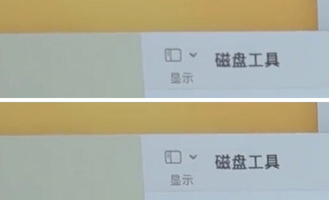

# FrameInterp — Hardware Frame Interpolation Player for macOS

**The native Apple Silicon replacement for SVP4 Pro on Mac.** Real-time motion-compensated
frame interpolation running on Apple's **Neural Engine / media engine** — turn 24 / 25 / 30 fps
video into 60 / 96 / 120 fps. Native arm64. **No Rosetta. No VapourSynth. No CPU burn.**

> In one line: **24 fps → 60 fps, fully smooth, using 0.12 of a CPU core.**

[简体中文](README.md) · [Download the latest release](https://github.com/lrylnx/frameinterp/releases/latest)

> **Aliases you might be searching for** — Mac frame interpolation player · macOS frame
> interpolation · video interpolation for Apple Silicon · smooth video playback on Mac ·
> 24fps to 60fps realtime · **SVP4 Pro alternative for Mac / SVP4 replacement** ·
> GPU-free / low-CPU frame interpolation · Neural Engine interpolation ·
> anime 60fps playback on macOS · judder-free playback

---

> ### ⚠️ SECURITY NOTICE (2026-09-21, fixed in 1.5)
>
> **The *File → Set as Default Player…* menu in 1.4 and earlier freezes the machine.**
> To bypass the system's confirmation prompts it wrote Apple's LaunchServices preferences
> directly and hard-killed the daemon with `killall -9 lsd`, which corrupts the
> LaunchServices database — the symptom is a **total freeze (the cursor moves, nothing else
> responds) that keeps happening at the same point after a force restart**.
>
> - **Upgrade to 1.5 now** and stop using that menu in older versions.
> - Already affected? **[Recovery steps are in RECOVERY.md](RECOVERY.md).**
> - In 1.5 the feature uses only the official system API, backs up the previous values and can
>   be undone in one click. The price is one system confirmation dialog per content type on
>   macOS 26.4+ — **that dialog cannot be bypassed**, and the attempt to bypass it is exactly
>   what caused the incident above.

---

## Table of contents

- [The problem](#the-problem)
- [How it differs from SVP4 Pro](#how-it-differs-from-svp4-pro)
- [Measured numbers](#measured-numbers)
- [Quality enhancement](#quality-enhancement-gpu-upscale--sharpen)
- [Requirements](#requirements)
- [Download & install](#download--install)
- [Usage](#usage)
- [How the interpolation gear is chosen](#how-the-interpolation-gear-is-chosen)
- [FAQ](#faq)
- [Known limitations](#known-limitations)
- [About the source code](#about-the-source-code)

---

## The problem

Watching 24 fps films or anime on a 60 Hz / 120 Hz / 180 Hz display produces **judder** —
the source frame rate and the display refresh rate don't line up, so the display layer has to
repeat the last frame to fill the cadence. It's obvious on any horizontal pan.

On macOS the traditional answer is **SVP4 Pro** (SmoothVideo Project), which does
**CPU optical flow + OpenCL rendering**. On Apple Silicon that has three unavoidable problems:

1. It's **x86_64**, running under **Rosetta**;
2. Optical flow saturates every core — **fans spin up, laptops get hot**;
3. It uses **OpenCL**, which Apple has stopped pushing for years.

**But Apple Silicon already contains dedicated silicon for exactly this job.**
`VTLowLatencyFrameInterpolation` (part of the `VTFrameProcessor` family) exists for real-time
frame interpolation, runs on the Neural Engine / media engine, and produces one intermediate
frame per call with **zero lookahead** and low latency. This player drives it directly.

---

## How it differs from SVP4 Pro

| | SVP4 Pro (Mac) | FrameInterp |
|---|---|---|
| Motion estimation | CPU (mvtools, all cores) | **Hardware** (`VTFrameProcessor`) |
| Frame rendering | OpenCL (legacy, no longer advanced by Apple) | Same processor, in-pipeline |
| Architecture | x86_64 under Rosetta | **Native arm64** |
| CPU for 30 → 60 fps | Several cores | **0.12 of a core** |
| Dependencies | VapourSynth / mpv / SVP stack | **One .app, drag it in** |
| OS support | Also runs on old systems | **macOS 26+ / Apple Silicon** (hard limit) |
| Tuning knobs | Very extensive | Just Off / 2× / 4× |

**To be fair to SVP**: its strength is that it **runs on old Intel Macs and older macOS**, and it
offers far more tuning parameters. This player trades "runs anywhere" for "costs almost no CPU and
works out of the box", and the price is a **hard macOS 26 floor**.

Also note the hardware path is **zero-lookahead** — it must produce an intermediate frame from
just "previous + current". So **large occlusion regions** won't be as clean as multi-frame-lookahead
software algorithms. That's a fundamental trade-off, and it's what buys the real-time capability.

---

## Measured numbers

Test machine: Apple Silicon (10 cores, fanless laptop), **macOS 27**; 1080p source; external 2560×1440 @ 180 Hz display.

```
source 29.999 fps  ->  interpolated 60.00 fps  [2x]  screen 180Hz
measured 60.3 fps     921 frames out   buffer 0.06s   playing
CPU 13.7%  (0.14 core)   no stutter

source 23.943 fps  ->  interpolated 95.77 fps  [4x]  screen 180Hz
measured 96.3 fps     2065 frames out  buffer 0.08s   playing
CPU 7.0%   (0.07 core)   no stutter
```

> ⚠️ **The 1080p figures above were measured on macOS 27.** On macOS 26.x the interpolation
> unit caps the input at **921,600 pixels** (= 1280×720), so 1080p is over the limit.
> Since **1.3** the player automatically downscales *only the interpolation path* to 1280×720
> and scales the result back up — you still get a 1080p picture at 60fps, but the
> **interpolated** frames carry 720p-level detail. Original frames (every second frame)
> keep their full resolution. The actual interpolation size is shown on the HUD.

These are read straight off the player's own HUD (press `i` while playing).
The same HUD, interpolation on vs off:


> Top: `60.00 fps [2×]`, measured 61.4 fps, **CPU 11.6% (0.12 core)**
> Bottom: `30.00 fps [passthrough]`, measured 31.1 fps — the original cadence with interpolation off.

| Scenario | CPU |
|---|---|
| 30 fps → 60 fps (2×) | **~0.12 – 0.14 of a core** |
| 24 fps → 96 fps (4×) | **~0.07 – 0.10 of a core** |

> 4× costs *less* than 2× because the cost scales with **source frames**: a 24 fps source only needs
> 24 frame-pairs per second, a 30 fps source needs 30. **The multiplier itself barely costs anything** —
> it only affects the final blending step.

More screenshots:

| | |
|---|---|
| [](docs/2x-60fps.png) | [](docs/4x-96fps.png) |
| 2× → 60 fps | 4× → 96 fps (cascaded interpolation) |
| [](docs/auto-fallback.png) | [](docs/network-stream.png) |
| Automatic fallback when hardware can't keep up | Network streams, download-while-playing |

---

## Quality enhancement (GPU upscale + sharpen)

> New in 1.4. **When playing 1080p footage, each frame is first upscaled to the physical pixel
> size of your window and adaptively sharpened, then handed to the display layer as a 1:1 blit** —
> instead of letting the display layer bilinearly stretch 1080p to the window. The cost lands
> almost entirely on the GPU: **CPU rises by only 0.03 of a core, frame rate unchanged.**

The old path was: decode 1080p → the display layer bilinearly scales it up to window size.
Bilinear **kills high frequencies**, so text edges, textures and fan blades look soft. Now an
extra GPU pass sits before the display layer:

- **Upscale** to the pixel size the display layer actually needs (derived from the screen's
  backing scale and the real on-screen height; upscale only, never downscale)
- **Sharpen** applied to the luma channel only, using an unsharp mask of "1 source-pixel radius"
  with contrast-adaptive clamping — flat areas are left alone (so compression noise isn't
  amplified), only true edges get sharpened
- Done in a **single YCbCr bi-planar pass** with **no RGB round-trip**, hence no colour shift

**Cost** (M4 / 1500×900 window / 1080p source):

| | CPU | Measured frame rate |
|---|---|---|
| Enhancement on | **0.22 core** | 60.96 fps |
| Enhancement off | 0.19 core | 60.84 fps |

**Image quality** (same kernel, only the sharpening strength varied — the cleanest control):

| Region | Edge sharpness change |
|---|---|
| Keycap detail / texture | **+18%** |
| Text block on the chassis | **+22%** |
| Flat gradient areas | **0%** (untouched) |

Real-render A/B (same playback position, same window geometry): edge sharpness **+6.8%**.



> Pixels that deviate from the "sharpen 0" reference by **>32/255** account for just **0.003%** —
> no dark or bright halos.

**Why not Apple's ANE super-resolution?** `VTFrameProcessor` does contain super-resolution and
noise-filter processors, but on macOS 26.x all of them measured unusable: the low-latency scaler is
capped by a **921,600-pixel budget** (max 960×960 source, and it shares that budget with
interpolation), the quality-priority scaler **only supports 4×** and its model must be downloaded,
and the temporal noise filter is a **silent passthrough** (output pixel-identical to input).
Real-time quality gain therefore has to come from the GPU path. (macOS 27 fills these processors
in; this will be re-evaluated then.)

**Don't want it?** Press `s`, or use the ✨ button on the control bar.

---

## Requirements

**Both are hard requirements:**

| | |
|---|---|
| **macOS 26.0 or later** | Interpolation relies on Apple's `VTLowLatencyFrameInterpolation`, available since macOS 26 |
| **Apple Silicon (any M1 / M2 / M3 / M4)** | It's a native arm64 binary and does not use Rosetta |

- ❌ **Intel Macs will not work** — neither the silicon nor the API exists there
- ❌ **macOS 15 or earlier will not work**
- ✅ **M1 is enough** — interpolation cost is tiny; the bottleneck is decode

---

## Download & install

1. Grab `FrameInterp-1.5-arm64.dmg` from [**Releases**](https://github.com/lrylnx/frameinterp/releases/latest)
2. Open the DMG and **drag the app into Applications**
3. If Gatekeeper blocks the first launch ("unidentified developer"):
   **right-click the app → Open → Open**. The app is ad-hoc signed (no paid Apple Developer
   certificate), but it needs **no special permissions, makes no network calls, and uploads nothing**.

> ⚠️ **SECURITY NOTICE (fixed in 1.5): do not use the "Set as Default Player…" menu in
> version 1.4 or earlier.** To bypass the system's confirmation prompts, that version
> wrote Apple's LaunchServices preferences directly and then hard-killed the daemon with
> `killall -9 lsd` — which **corrupts the LaunchServices database and freezes the whole
> machine** (the cursor moves, nothing else responds), **and it stays frozen after a force
> restart**. Machines already affected: see [RECOVERY.md](RECOVERY.md) for the recovery steps.
> In 1.5 the feature only uses the official system API, backs up the previous values first,
> and can be undone in one click.

> **Want it as your default player?** Menu → *File → Set as Default Player…*. It uses the
> official system API to set mp4 / m4v / mov / mkv / avi / webm / ts / flv (8 types) one at a
> time, **backing up the previous values first**; use *Undo default associations…* in the same
> menu to restore them.
>
> Note: **from macOS 26.4 onward the system shows one confirmation dialog per type** — that is
> a system restriction with no bypass (1.4 tried to bypass it and caused the incident above).
> If the dialogs are too much, do it yourself: right-click a video → *Get Info* → *Open with*
> → pick this player → *Change All…*. One type at a time, entirely safe.

---

## Usage

Double-click the app, drop a video in. That's it.

**Ways to open**
- Double-click the app → empty window → drag a video in
- Right-click a video → *Open With* → the player
- Drag a video onto the Dock icon

**Keyboard**

| Key | Action |
|---|---|
| `Space` | Play / pause |
| `←` `→` | Back / forward 5 s (hold `Shift` for 30 s) |
| `↑` `↓` | Volume + / − (5% steps) |
| `f` | Fullscreen (`Esc` to exit) |
| `i` | Toggle the on-screen status HUD |
| `[` `]` | Lower / raise interpolation (Off → 2× → 4×) |
| `Esc` | Exit fullscreen, or quit when not fullscreen |

**Supported input**
- Natively decodable formats (mp4 / mov / m4v) play **directly, zero dependencies**
- mkv / rmvb / flv containers are automatically **remuxed** (`-c copy`, no re-encode, takes seconds)
  using your system `ffmpeg`, cached under `~/Library/Caches/` — the same file opens instantly next time
- **Network streams** (m3u8 / direct mp4 links) work too, downloading while playing. This path needs
  `ffmpeg` installed (`brew install ffmpeg`)

**UI**: controls and the cursor auto-hide after 3 seconds of inactivity, and come back on mouse move.

**Your display won't dim during playback.** While playing, the app holds a power assertion
(`IOPMAssertion` / `PreventUserIdleDisplaySleep` — the same one behind `caffeinate -d`), so the
screen stays on and won't slowly fade to black mid-movie. It's released the moment you pause,
finish, or close the window. If you only want audio, uncheck
*Play menu → Keep display awake during playback*.

> To check it yourself: while playing, run `pmset -g assertions | grep FrameInterp`. You should see
> `PreventUserIdleDisplaySleep named: "FrameInterp: video playback"` with a count of `1`;
> it returns to `0` once paused or quit.

---

## How the interpolation gear is chosen

Three positions only: **Off / 2× / 4×**. Switch with `[` `]` — **playback continues uninterrupted**.

When you open a file the player **picks the highest gear** subject to two hard constraints:

1. Hardware throughput (at 1080p: about 76 pairs/s for 2×, 26.7 pairs/s for 4×)
2. **Output frame rate should not exceed the display refresh rate** (anything above is wasted work)

| Source fps | 180 Hz display | 60 Hz display |
|---|---|---|
| 24 fps | **4× → 96 fps** (full) | 2× → 48 fps |
| 25 fps | 4× (borderline) | 2× → 50 fps |
| 30 fps | 2× → 60 fps | 2× → 60 fps |
| ≥ 50 fps | Off / 2× | Off |

**It automatically steps down when it can't keep up.** Take a 30 fps source pushed to 4× manually:
the hardware delivers 26.7 pairs/s but 30 are needed — an 11% shortfall. The symptom isn't "low frame
rate", it's **uneven cadence**: the display layer repeatedly shows the last frame to fill the beat,
which looks *worse* than a steady 48 fps. So the player **corrects for you once** — reverting to 2×
after a few seconds and showing a notice. If you press `]` again after that, it stops interfering.

> **Why there is no 3× or 5×**: the hardware's interpolation phase is **quantized to 1/8 steps**
> (measured: a requested 0.333 snaps to 0.375, and the output frames are pixel-identical).
> 3× needs phases 1/3 and 2/3, which aren't on that grid → output spacing becomes
> 0.375 / 0.25 / 0.375, i.e. **uneven**, producing periodic judder that cancels out the benefit.
> And actually cascading 3× measures 86 ms/pair — more than twice the 37 ms of 4×.
> **Only powers of two** (2×/4×/8×) land every phase on a cheap grid point.

---

## FAQ

**Will it run on my Mac?**
Check two things: **macOS 26+** and **Apple Silicon**. If both hold, yes. No Intel Mac will work.

**Is "0.12 of a core" real?**
That's the HUD reading for 1080p, 30 → 60 fps (screenshot above). In Activity Monitor the CPU
column reads about 12%. Note the units: **0.12 of a core = 1.2% of total CPU on a 10-core machine**,
not 0.12%.

**How's the quality versus SVP4 Pro?**
Comparable on moderate motion and clean footage. On **large occlusion** (a foreground object sweeping
across the background) the software algorithm is cleaner, because it looks ahead over multiple frames
while the hardware path is zero-lookahead. But SVP burns several cores on Apple Silicon; this uses 0.12.

**Does it support subtitles?**
**Not in the current version.** See the known limitations below.

**Does it modify my video files?**
No. Interpolation happens live during playback — nothing is written to disk, nothing is re-encoded.

**Why doesn't it help with 4K or 60 fps sources?**
4× at 4K exceeds hardware throughput (4× at 1080p is already near the ceiling), and sources at
≥ 50 fps have little to interpolate. The player automatically drops the gear or goes passthrough.

**Can it play network / online video?**
Yes — `m3u8` and direct `mp4` links, downloading while playing. Requires `ffmpeg` on your machine.
(A companion Chrome extension can sniff video streams from web pages and hand them to the player;
it is not distributed in this repository.)

---

## Known limitations

Listed plainly, so you find out now rather than after installing:

- **No subtitle rendering, no subtitle track support.** Not embedded, not external srt/ass.
  If you watch subtitled anime, this is a real gap.
- **The in-app UI is currently Chinese-only.** Only the *app name* is localized; menus, the
  status HUD, and on-screen notices are still hard-coded Chinese. An English-language UI is
  planned but not shipped yet — don't expect a fully localized interface.
- **macOS 26+ and Apple Silicon only** — not a lack of porting effort, it's a hardware/API floor.
- **Only 2× and 4×** — no 3× or 5× (see above for why).
- **No live streams** (indeterminate duration); the architecture assumes seekable, finite media.
- **Zero-lookahead algorithm** — mild artifacts are possible in large occlusion regions.
- **No features requiring special TCC permissions** (no screen recording, accessibility, or input monitoring).

---

## About the source code

**This is closed-source software; only the compiled `.app` is distributed.** This repository contains
documentation and download links only — **no source code** — and does not accept source contributions.

- Provided "as is", without warranty of any kind.
- You may freely download, install, and use it on your own devices.
- You may **not** decompile, disassemble, repackage, redistribute, or use it commercially.
- See [LICENSE](LICENSE) for details.

---

## Changelog

| Version | Changes |
|---|---|
| **1.5** | **Safety fix: "Set as Default Player…" can no longer freeze the machine.** Version 1.4 and earlier bypassed the system's confirmation prompts by writing Apple's LaunchServices preferences directly and hard-killing the daemon with `killall -9 lsd` — measured to **freeze the entire machine**, and **it stays frozen at the same point after a force restart** (the LaunchServices database is SIGKILLed mid-write, leaving a persistent corrupt state that blocks Finder, the Dock and the login flow). It now uses only the official system API, sets one type at a time, backs up the previous values, and can be undone in one click. Also removed the `public.audiovisual-content` supertype declaration (which claimed audio as well). **Upgrade immediately if you have 1.4 or earlier.** |
| **1.4** | Added **GPU quality enhancement** (upscale to the display's real pixel size + contrast-adaptive luma sharpening, single YCbCr pass, **only 0.03 core of extra CPU**); toggle with `s` or the ✨ control-bar button. Also established that on macOS 26.x all of the ANE super-resolution / noise-filter processors are unusable (see "Quality enhancement" above) |
| **1.3** | **Fixed 1080p-and-above interpolation silently failing on macOS 26.x.** The interpolation unit's maximum input size depends on the OS version (921,600 pixels on 26.x, higher on 27). When exceeded, `startSession` reports no error — only the actual calls fail — so interpolation broke completely while the HUD still showed the target frame rate. Now the limit is probed at runtime, oversized sources are downscaled on the interpolation path only (original frames keep full resolution), and failures are visible on the HUD |
| **1.2** | App renamed to **FrameInterp** (still shown as "硬件插帧播放" on Chinese systems); executable and cache directory renamed to match (the legacy directory is migrated automatically); the power-assertion name is now ASCII (see below) |
| 1.1 | **Fixed the display dimming and eventually sleeping during playback** — playback now holds an `IOPMAssertion`; added the *Keep display awake during playback* menu toggle |
| 1.0 | First public release |

> The small fix in 1.2 worth calling out: in 1.1 the power assertion was named in Chinese
> (`硬件插帧播放 正在播放视频`). The assertion worked, but `pmset -g assertions` rendered it as
> `named: ""` — **the name was dropped entirely**. Holding a second, ASCII-named assertion from the
> same process showed up correctly, confirming the non-ASCII name was the cause. Since the only
> purpose of the name is to make it obvious *who* is keeping the display awake, it now uses a fixed
> ASCII string.

---

## Feedback

Please open an [Issue](https://github.com/lrylnx/frameinterp/issues) and **include**:

1. Your macOS version and chip (e.g. `M4 / 10-core`)
2. The source frame rate and resolution of the video
3. A screenshot of the HUD (press `i` while playing) — it shows measured fps, CPU, and the stutter counter

Diagnostic files live in `~/Library/Caches/FrameInterp/` (`stat.txt`, `events.log`).
Attaching them saves a lot of back-and-forth.

---

*FrameInterp — because the hardware was already in your machine.*
