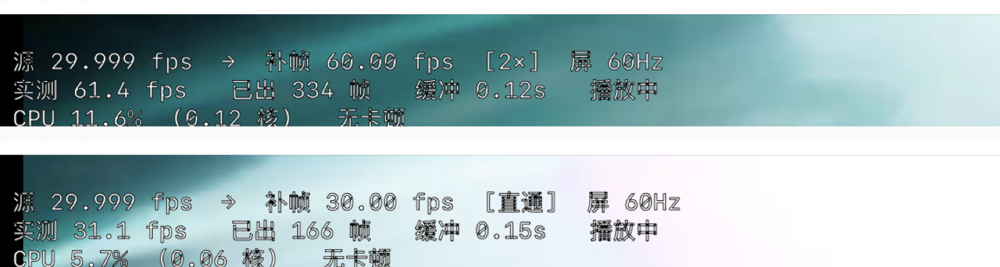
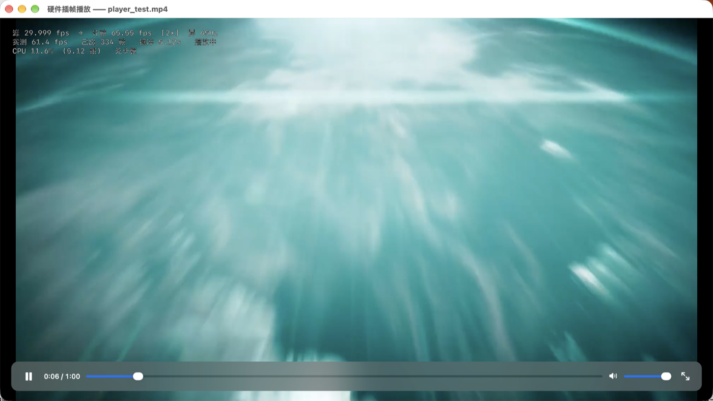
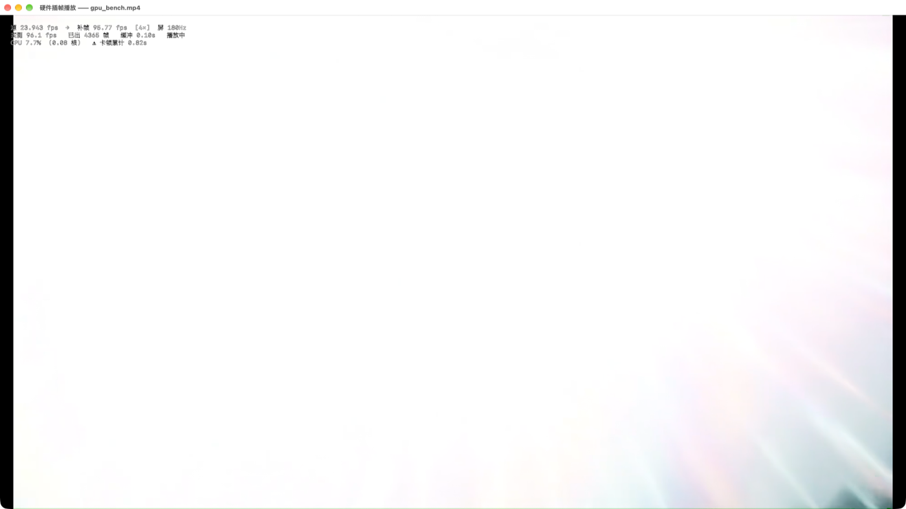
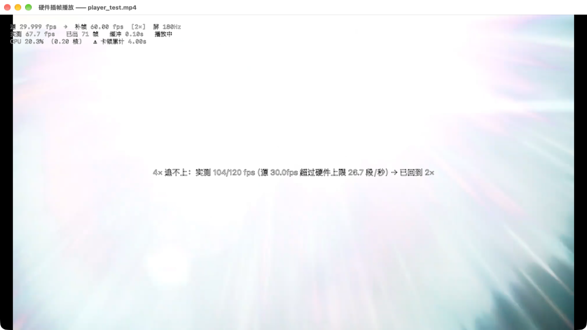
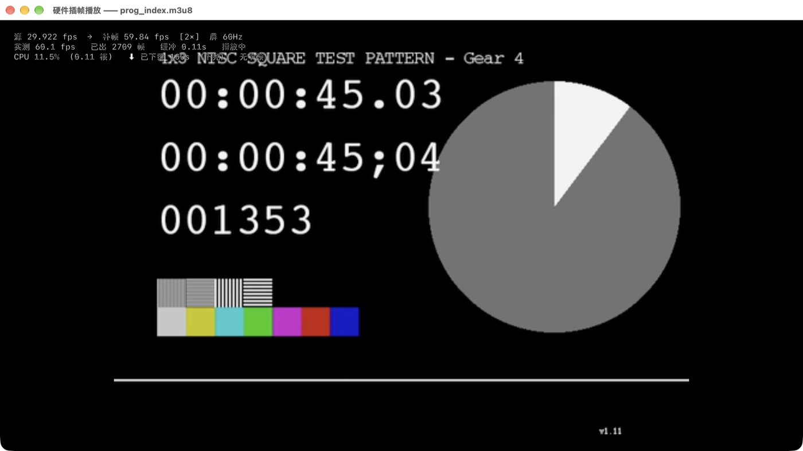

# FrameInterp（硬件插帧播放）— Mac 插帧播放器 · SVP4 Pro 的原生替代

**macOS 上 SVP4 Pro 的原生替代品。** 用 Apple 的**神经引擎**（Neural Engine / 媒体引擎）做实时补帧，
把 24 / 25 / 30fps 的片子补成 60 / 96 / 120fps。原生 arm64，**不需要 Rosetta，不需要 VapourSynth，不烧 CPU**。

> 一句话：**24fps → 60fps 满帧播放，只占 0.12 个 CPU 核心。**

[English](README.en.md) · [下载最新版](https://github.com/lrylnx/frameinterp/releases/latest)

> **你搜的可能就是这些词** —— Mac 插帧播放器 · Mac 补帧播放器 · 硬件插帧播放 ·
> Mac 视频补帧 60fps · 番剧补帧不掉帧 · **SVP4 Pro 的 Mac 替代 / SVP4 平替** ·
> macOS 上不烧 CPU 的补帧 · Apple 神经引擎插帧 · ANE 插帧 · M 系列芯片视频补帧 ·
> smooth video playback on Mac / frame interpolation macOS

---

## 目录

- [它解决什么问题](#它解决什么问题)
- [和 SVP4 Pro 的差别](#和-svp4-pro-的差别)
- [实测数据](#实测数据)
- [系统要求](#系统要求)
- [下载与安装](#下载与安装)
- [使用](#使用)
- [插帧档位怎么选](#插帧档位怎么选)
- [常见问题](#常见问题)
- [已知限制](#已知限制)
- [关于开源](#关于开源)

---

## 它解决什么问题

看番、看片、看 24fps 电影时，画面在 60Hz / 120Hz / 180Hz 屏幕上会有**抖动**（judder）——
因为源帧率和屏幕刷新率对不上，显示层只能靠「同一帧重复显示」去凑节拍，横向摇镜一眼就能看出来。

传统解法是在 Mac 上装 **SVP4 Pro**（SmoothVideo Project）做运动补偿补帧。它的做法是
**CPU 算光流 + OpenCL 渲染**，在 Apple Silicon 上有三个绕不过去的问题：

1. 它是 **x86_64** 的，在 macOS 上靠 **Rosetta** 跑；
2. 光流是多核跑满的活，**风扇会转，笔记本会烫**；
3. 用的是 Apple 早就不推进的 OpenCL。

**但 Apple Silicon 里本来就有一块专门干这个的硬件。** `VTLowLatencyFrameInterpolation`
（属于 `VTFrameProcessor` 系列）就是给实时补帧用的，跑在神经引擎 / 媒体引擎上，
一次调用出一张中间帧，零前瞻、低延迟。这个播放器就是直接驱动它。

---

## 和 SVP4 Pro 的差别

| | SVP4 Pro (Mac) | FrameInterp |
|---|---|---|
| 运动搜索 | CPU（mvtools，多核跑满） | **硬件**（`VTFrameProcessor`） |
| 帧渲染 | OpenCL（老 API，Apple 已不推进） | 同一颗处理器内完成 |
| 架构 | x86_64，靠 Rosetta | **原生 arm64** |
| 30 → 60fps 时的 CPU | 好几个核心 | **0.12 个核心** |
| 需要装的依赖 | VapourSynth / mpv / SVP 一大套 | **一个 .app，拖进去就能用** |
| 支持的系统 | 老的也能跑 | **macOS 26+ / Apple Silicon**（硬性） |
| 调参 | 非常丰富 | 只有 关 / 2× / 4× |

**说句公道话**：SVP 强在**能在老 Intel Mac 和旧系统上跑**，而且调节参数多得多。
这个播放器的取舍是把「能跑」换成「几乎不花 CPU、开箱即用」，代价是**系统门槛卡死在 macOS 26**。

另外，硬件这条路径是**零前瞻**的（只给「前一帧 + 当前帧」就要出中间帧），
所以**大面积遮挡区域**的干净程度不如多帧前瞻的软件算法。这是原理决定的取舍，
换来的是它能在实时链路上跑起来。

---

## 实测数据

测试机：Apple Silicon，10 核，无风扇笔记本；素材 1080p；外接 2560×1440 @ 180Hz 屏。

```
源 29.999 fps  →  补帧 60.00 fps   [2×]  屏 180Hz
实测 60.3 fps   已出 921 帧   缓冲 0.06s   播放中
CPU 13.7%  (0.14 核)   无卡顿

源 23.943 fps  →  补帧 95.77 fps   [4×]  屏 180Hz
实测 96.3 fps   已出 2065 帧   缓冲 0.08s   播放中
CPU 7.0%   (0.07 核)   无卡顿
```

上面是播放器自己的 HUD（播放中按 `i` 开关）。同一个 HUD 的对比截图：



> 上半：`补帧 60.00 fps [2×]`，实测 61.4fps，**CPU 11.6%（0.12 核）**
> 下半：`补帧 30.00 fps [直通]`，实测 31.1fps —— 插帧关掉后的原始节奏。

| 场景 | CPU |
|---|---|
| 30fps → 60fps（2×） | **约 0.12 ~ 0.14 个核心** |
| 24fps → 96fps（4×） | **约 0.07 ~ 0.1 个核心** |

> 4× 反而比 2× 更省，是因为成本按**源帧**算：24fps 的源每秒只要处理 24 对帧，
> 30fps 的源要处理 30 对。**倍率本身几乎不增加成本**，它只影响最后合帧那一小步。

更多画面：

| | |
|---|---|
| [](docs/2x-60fps.png) | [](docs/4x-96fps.png) |
| 2× → 60fps | 4× → 96fps（级联插帧） |
| [](docs/auto-fallback.png) | [](docs/network-stream.png) |
| 硬件追不上时自动降档 | 网络流边下边播 |

---

## 系统要求

**两条都是硬性的，缺一不可：**

| | |
|---|---|
| **macOS 26.0 或更高** | 插帧依赖 Apple 的 `VTLowLatencyFrameInterpolation`，这个 API 从 macOS 26 才有 |
| **Apple Silicon（M1 / M2 / M3 / M4 全系）** | 它是 arm64 原生程序，也不用 Rosetta |

- ❌ Intel Mac **不能用**（没有那块硬件，也没有这个 API）
- ❌ macOS 15 及以前 **不能用**
- ✅ M1 也能跑 —— 补帧开销小，瓶颈基本在解码

---

## 下载与安装

1. 到 [**Releases**](https://github.com/lrylnx/frameinterp/releases/latest) 下载 `FrameInterp-1.2-arm64.dmg`
2. 打开 DMG，把「FrameInterp.app」**拖进 Applications**
   （**中文系统上它会显示成「硬件插帧播放」** —— 同一个 App，名字跟着系统语言走）
3. 首次打开如果被 Gatekeeper 拦下（提示"无法验证开发者"）：
   **右键点 app →「打开」→ 再点「打开」**。本 App 是 ad-hoc 签名，没买 Apple 开发者证书，
   但不需要任何特殊权限、不联网、不上传任何东西。

> **想让它当默认播放器**：菜单「文件 → 设为默认播放器…」，
> 一次把 mp4 / mov / mkv / avi / webm / ts / flv / rmvb 等 20 种类型全部关联好，**全程无弹窗、不用密码**。

---

## 使用

双击 app → 把视频拖进窗口。就这两步。

**打开方式**
- 双击 App → 空窗口 → 拖视频进去
- 视频上右键 →「打开方式」→ FrameInterp（中文系统显示「硬件插帧播放」）
- 直接把视频拖到 Dock 上的图标

**快捷键**

| 键 | 作用 |
|---|---|
| `空格` | 播放 / 暂停 |
| `←` `→` | 快退 / 快进 5 秒（按住 `Shift` 是 30 秒） |
| `↑` `↓` | 音量 + / −（每次 5%） |
| `f` | 全屏（`Esc` 退出全屏） |
| `i` | 开关左上角状态显示（HUD） |
| `[` `]` | 降 / 升插帧倍数（关 → 2× → 4×） |
| `Esc` | 全屏时退全屏；非全屏时退出播放器 |

**支持拖进来的格式**
- 原生能解的（mp4 / mov / m4v）**直接播，零依赖**
- mkv / rmvb / flv 这类容器会自动用系统的 `ffmpeg` 做一次**转封装**（`-c copy`，不重编码，几秒完成），
  缓存到 `~/Library/Caches/FrameInterp/`，同一个文件下次秒开
- **网络流**（m3u8 / mp4 直链）也能放，边下边播；这条需要本机装了 `ffmpeg`（`brew install ffmpeg`）

**界面**：鼠标不动 3 秒，控制条和指针一起自动隐藏；动一下鼠标就回来。

**播放时屏幕不会自己黑掉**：只要在播放，播放器就持一条电源断言
（`IOPMAssertion` / `PreventUserIdleDisplaySleep`，就是 `caffeinate -d` 用的那个），
屏幕会一直亮着，不会播着播着慢慢变暗。暂停 / 播完 / 关窗口立刻释放。
只想听声音的话，菜单「播放 → 播放时保持屏幕常亮」可以把勾去掉。

> 想自己确认一下：播放中执行 `pmset -g assertions | grep FrameInterp`，应该看到
> `PreventUserIdleDisplaySleep named: "FrameInterp: video playback"`，计数为 `1`；
> 暂停或退出后回到 `0`。

---

## 插帧档位怎么选

只有 **关 / 2× / 4×** 三档。按 `[` `]` 切换，**切换时画面不中断，就地续播**。

打开文件时播放器会**自动挑最高的那档**，受两条硬约束：

1. 硬件吞吐上限（1080p：2× 约 76 段/秒，4× 约 26.7 段/秒）
2. **输出帧率不该超过屏幕刷新率**（超了就是白算）

| 源帧率 | 180Hz 屏 | 60Hz 屏 |
|---|---|---|
| 24 fps | **4× → 96fps**（满帧） | 2× → 48fps |
| 25 fps | 4×（擦边） | 2× → 50fps |
| 30 fps | 2× → 60fps | 2× → 60fps |
| ≥ 50 fps | 关 / 2× | 关 |

**追不上会自动降档。** 例如 30fps 的源手动升到 4×：硬件只给 26.7 段/秒，而要 30 段/秒，
差的就是那 11%。这时候的表现不是"帧率低"，而是**节奏不匀**（显示层周期性重复最后一帧去填节拍），
看着比稳定满帧的 48fps 更顿。所以播放器会**替你纠一次** —— 几秒后自动退回 2×，
并在画面中间弹一句说明。之后你要是又按 `]` 升上去，它就不再插手了。

> **为什么没有 3× / 5×**：硬件的插值相位被**量化到 1/8 格点**（实测 0.333 会被吸附到 0.375，
> 输出的帧逐像素完全相同）。3× 要 1/3 和 2/3，这两个数不在格点上 → 输出帧距变成
> 0.375 / 0.25 / 0.375，**不均匀**，画面会有周期性节奏不齐，高帧率的优势被抵消掉。
> 而且真按 3× 去级联，实测 86ms/对，比 4× 的 37ms 还慢一倍多。
> **只有 2 的幂的倍率**（2×/4×/8×）所有相位都落在便宜的格点上。

---

## 常见问题

**Q：我的 Mac 能跑吗？**
A：看两点 —— **macOS 26+** 和 **Apple Silicon**。两个都满足就能跑。Intel Mac 全系不行。

**Q：真的只占 0.12 个核心？**
A：这是 1080p、30fps → 60fps 情况下的 HUD 实测值（截图在上面）。
用 `活动监视器` 看，CPU 那一列大约就是 12%。注意口径不同：
**0.12 个核心 = 10 核机器上的 1.2% 总 CPU**，不是 0.12%。

**Q：和 SVP4 Pro 比画质谁好？**
A：中低速运动、干净素材上两者接近；**大面积遮挡**（比如前景物体快速横穿背景）软件算法更干净，
因为它是多帧前瞻，硬件这条是零前瞻。但 SVP 在 Apple Silicon 上要烧掉几个核心，这个只要 0.12 个。

**Q：支持字幕吗？**
A：**当前版本不渲染字幕。** 这是已知缺口，见下面的「已知限制」。

**Q：为什么 App 叫 FrameInterp，界面和窗口标题却是中文？**
A：名字**跟着系统语言走**。中文系统上它显示为「硬件插帧播放」，其它语言显示 FrameInterp ——
通过 `zh-Hans.lproj` 本地化实现，是同一个 App（bundle id 始终是 `cn.zxwzz.hipl`）。
另注：缓存和日志目录名固定为 `~/Library/Caches/FrameInterp/`，**不跟随语言**
（否则换一次系统语言就会写到另一个目录，老缓存全部对不上）。

**Q：会修改我的视频文件吗？**
A：不会。插帧是**播放时实时算**的，不落盘、不改文件。

**Q：为什么 4K 或者 60fps 的源效果不明显？**
A：4× 在 4K 上硬件吞吐跟不上（1080p 的 4× 就已经贴着上限了）；源本身 ≥ 50fps 时也没什么可补的。
这两种情况播放器会自动选低档或直通。

**Q：能拉网络流 / 在线视频吗？**
A：能，`m3u8` / `mp4` 直链都行，边下边播。需要本机有 `ffmpeg`。
（配套还有一个 Chrome 扩展可以嗅探网页里的视频流丢给播放器，不在本仓库发布。）

---

## 已知限制

如实列出来，省得你装完才发现：

- **不渲染字幕 / 字幕轨不支持**。外挂 srt / ass 也读不了。看番的话这是个实际缺口。
- **界面目前只有中文**（菜单、状态浮层、提示语）。1.2 只把**应用名**做了本地化，
  英文界面还没做 —— 英文系统上你会看到名叫 FrameInterp、菜单却是中文。
- **只能跑在 macOS 26+ 和 Apple Silicon 上**，不是"没适配"，是硬件和 API 的硬门槛。
- **只有 2× / 4× 两档**，没有 3× / 5×（原理见上）。
- **不支持直播流**（时长不确定的流），架构是按"可 seek 的定长素材"设计的。
- **零前瞻算法**，大面积遮挡区域可能出现轻微的伪影。
- 需要 TCC 特殊权限的功能一律没有（不申请屏幕录制 / 辅助功能 / 输入监控）。

---

## 关于开源

**本项目是闭源软件，只分发编译好的 .app。** 仓库里只有说明文档和下载链接，
**不包含源代码**，也不接受源码形式的贡献。

- 软件按「现状」提供，不附带任何形式的担保。
- 允许自由下载、安装、在个人设备上使用。
- **不允许**反编译、反汇编、二次打包、重新分发、商业使用。
- 详见 [LICENSE](LICENSE)。

---

## 版本历史

| 版本 | 变更 |
|---|---|
| **1.2** | 应用名改为 **FrameInterp**（中文系统仍显示「硬件插帧播放」）；可执行文件与缓存目录同步更名（老目录自动搬迁）；电源断言的登记名改为 ASCII（见下） |
| 1.1 | **修复播放中屏幕自动变暗直至休眠**：播放期间持有 `IOPMAssertion`；新增菜单开关「播放时保持屏幕常亮」 |
| 1.0 | 首次公开版本 |

> **1.2 里那个「断言名改 ASCII」的小修正**，值得单说一句：1.1 的断言名是中文的
> （`硬件插帧播放 正在播放视频`）。断言本身工作正常，但 `pmset -g assertions` 会把它
> 渲染成 `named: ""` —— **名字被整个丢掉**。同一个进程里同时挂一条 ASCII 名做对照，
> ASCII 那条显示正常，所以确认是中文名的问题。断言名唯一的作用就是"排查时看出是谁
> 把屏幕钉亮的"，名字没了就等于白持，因此改成固定的 ASCII 名。

---

## 反馈

遇到问题请开 [Issue](https://github.com/lrylnx/frameinterp/issues)，**请务必附上**：

1. macOS 版本、芯片型号（如 `M4 / 10 核`）
2. 视频的源帧率与分辨率
3. 播放中按 `i` 打开 HUD 后的截图（里面有实测帧率、CPU、卡顿计数）

诊断文件在 `~/Library/Caches/FrameInterp/` 下（`stat.txt` / `events.log`），
报问题时一并附上能省很多来回。

---

*FrameInterp（硬件插帧播放）— 因为那块硬件本来就在你机器里。*
